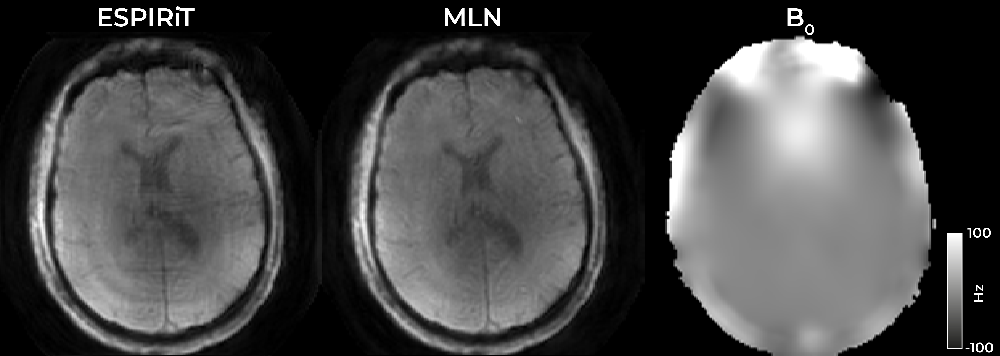
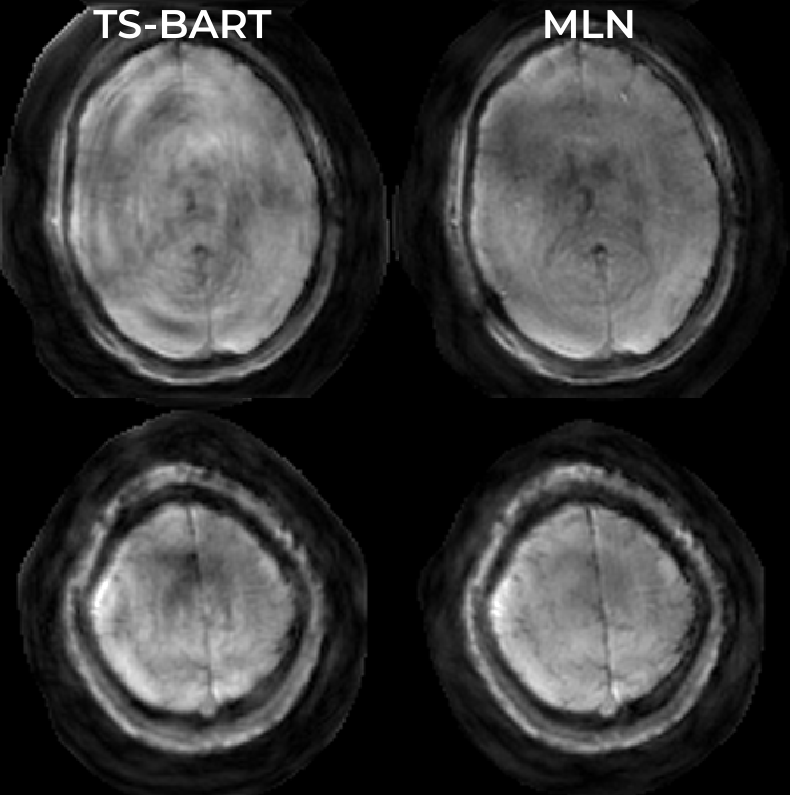
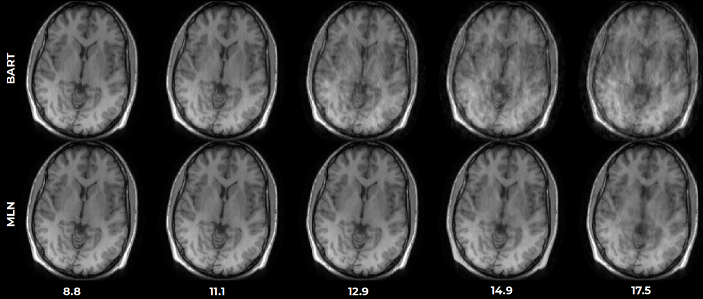

# MLN

Material for: Minimal Linear Networks for MR image reconstructiom

The main topology, Complex-valued ~~neural~~ linear networks, a *k* and I layers with location-independent (variable-density) kernels with several "time-segments" is able to produce artifact-free images where standard advanced (e.g. compressed sensing, etc.) reconstruction fails.

Example on a spiral trajectory, compared vs. ESPIRiT with an augmented signal model with B0 inhomogeneities correction:



The difference is more pronounced in the case of a multi-band spiral trajectory with with incoherent CAIPI blips, vs. BART with augmented signal model:



Vs. common methods on our benchmark data:



## TF-NUFFT
NUFFT with B0 field inhomogeneities correction by the time-segments method is implemented in tensorflow to run on the GPU.

# Parameters

The system is highly configurable from the human-readable `params.txt` . Most parameters are rather self-explanatory; some additional information can be found here: https://docs.google.com/document/d/18lZOREQs4aX6HWqjV1Dn5tCwnAgcu9XmiUsXeqp5uRQ/edit?usp=sharing

# Requirements

The code is based on https://github.com/david-gpu/srez, so in case of errors it might be useful to verify srez is working. Installation should take no more than several minutes.

You will need Python 3 with Tensorflow, numpy, scipy, h5py and [moviepy](http://zulko.github.io/moviepy/).
See srez -`requirements.txt` for details.

The "CUDA_VISIBLE_DEVICES" is set at the beginning of `srez_main1.py`. The code uses some forced 'with /gpu:0'. Remove soft allocation (on `srez_main1.py`) to verify the main computation is done entirely on the GPU.

They system was developed on python 3.6.5, tensorflow 1.10.1, on a desktop machine with a GTX 1080 Ti GPU. MATLAB R2018a scripts are used for calling the system. Running pretrained nets should work well on CPU-only. 32GB RAM is advised.

# Dataset
The dataset used for the real data and benchmark test is a collection of randomly chosen slices from the HCP. It can be downloaded from https://figshare.com/s/4e700474da52534efb30 . The data is augmented with random cropping, flipping and 90deg rotation, and a random 2D phase is added. The following parameters deternine the strength of the added phase: RandomPhaseLinearFac, RandomPhaseQuadraticFac, RandomPhaseScaleFac

For the real data, the acquired signal, the trajectory, MIRT-based NUFFT coefficients and time-segments data are included here.
For the benchmark test, the poisson-disc masks and the images used are provided, as well as the reconstructed images using various methods.

## For training: download the dataset (2.4GB)
```
wget -O HCPData_256x256_int16.mat https://ndownloader.figshare.com/files/12420215?private_link=4e700474da52534efb30
```

## Downloading trained networks - real data
The download may take a moment. ~560MB
```
wget -O ./RealData/RegridTry3C2_7TS_S01_Sli06.tar.xz https://ndownloader.figshare.com/files/13198547?private_link=61f25dc380af32a12da3
tar xf RealData/RegridTry3C2_7TS_S01_Sli06.tar.xz -C RealData
```

## Downloading trained netork - benchmark
The download may take several minutes. ~ 4.3GB
```
wget -O P2DF.tar.xz https://ndownloader.figshare.com/files/13198568?private_link=65c0e9f77f23c664aabe
tar xf P2DF.tar.xz
```

# Training and running the model

Training can be done by calling `python srez_main1.py`. The dataset used is set by the parameter `DatasetMatFN` in `params.txt`.

If *ShowRealData*=1, the output every *summary_period* (minutes) will include a run on the data in *RealDataFN*.

Running a trained network on a series of .mat files, given in the format Path/Prefix_XX.mat, can be done my setting the following parameters in `params.txt`:
LoadAndRunOnData=1,LoadAndRunOnData_checkpointP,LoadAndRunOnData_Prefix
LoadAndRunOnData_OutP, HowManyToRun - see example in current `params_ex.txt`

For running training on the example real data, from the base folder, after downloading the dataset, run:
```
cp ./RealData/ParamsUsed.txt ./Params.txt
source ~/tensorflow/bin/activate (or any other way to activate the tensorflow environment)
<Tensorflow-python> srez_main1.py 
```
Where \<Tensorflow-python\> is e.g. ~/tensorflow/bin/python.

# Calling from MATLAB
`RunTFForMatlab.sh` should be edited with the correct folders, CUDA, etc.
similarly, the .m scripts have some folder definitions that need to be adjusted. 
